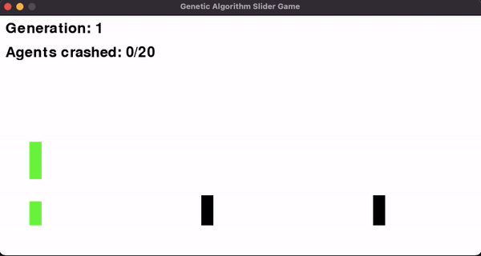
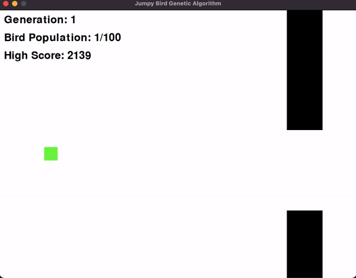
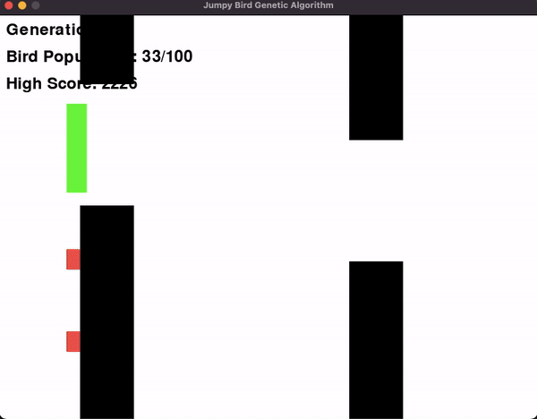

# Simulations

Projects focusing on using Genetic Algorithms and basic Neural Networks to play games and simulate natural or emergent processes.

## Unsupervised learning 

The algorithms used in jumpy-bird and jumpy bricks are examples of using a genetic algorithm (GA) combined with a neural network to create and evolve an intelligent agent. This approach differs significantly from traditional neural network training methods, such as backpropagation, which is commonly used in supervised learning.

## Jumpy Bricks Simulation

Agents must jump over incoming bricks or they crash and are elininated from the current generation.

## Jumpy Bird Simulation

Birds must navigate through the course while avoiding pipes and keeping themselves from hitting the ground.

### Differences from a Typical Neural Network Setup

1. **Learning Methodology**:
   - **Genetic Algorithm (GA)**: In this setup, the learning process is inspired by natural selection. Instead of training the neural network using gradient descent and backpropagation, the birds evolve by selecting the best-performing individuals, combining their "genes" (network weights), and introducing random mutations.
   - **Typical Neural Network**: Typically, neural networks learn using supervised learning, where they are provided with labeled data. The network's weights are adjusted using backpropagation to minimize the difference (loss) between the network's predictions and the actual labeled data.

2. **Optimization Objective**:
   - **GA with Neural Network**: The optimization is based on a fitness function that evaluates how well each bird performs (e.g., how far it gets in the game or how many pipes it successfully passes). Birds that perform better have a higher chance of being selected for reproduction.
   - **Typical Neural Network**: The optimization objective is to minimize a loss function, usually calculated as the difference between predicted outputs and actual labels in a dataset. This is done iteratively using backpropagation to adjust weights.

3. **Adaptation and Training**:
   - **GA with Neural Network**: Adaptation occurs over generations. Each new generation starts with a population that has evolved from the previous generation. Offspring are created by combining the genetic material (weights) of the best parents and adding random mutations. This simulates natural evolution.
   - **Typical Neural Network**: Training occurs through multiple iterations (epochs) over a dataset. Weights are updated continuously to minimize the loss. Adaptation happens within a single neural network as its weights are refined over time.

4. **Data Requirements**:
   - **GA with Neural Network**: There is no need for labeled training data. The environment itself provides feedback through the fitness function (e.g., survival time, distance traveled).
   - **Typical Neural Network**: Requires labeled training data. The learning process depends on large amounts of data for supervised learning tasks.

### How the Model Evolves

1. **Initialization**: A population of birds (agents) is initialized, each with a random neural network (random weights and biases). This represents the initial genetic diversity.

2. **Simulation and Fitness Evaluation**: Each bird is tested in the Flappy Bird game environment. The fitness of each bird is determined by how well it performs (e.g., how long it survives, how many pipes it passes). Fitness is used to measure the quality of each bird's neural network.

3. **Selection**: After each generation (when all birds have died), a selection process identifies the best-performing birds (those with the highest fitness scores). These birds are chosen to be parents for the next generation.

4. **Crossover**: New offspring are generated by combining the weights of two parent birds. This crossover can be done by randomly selecting weights from each parent to create a child. This process mixes the genetic information, allowing offspring to inherit traits from both parents.

5. **Mutation**: Random mutations are introduced to the offspring's weights. Mutations are small changes to the weights and biases to introduce variability and explore new potential solutions. This helps prevent the population from becoming stuck in local optima and encourages diversity.

6. **Next Generation**: The new population of birds (offspring) is tested in the environment. The process of evaluation, selection, crossover, and mutation is repeated. Over successive generations, the population evolves, and the birds' neural networks become better suited to the task of navigating the game environment.

### Key Points of the Evolutionary Approach

- **No Gradient-Based Optimization**: The GA approach doesn't use gradients or backpropagation. Instead, it relies on trial and error, selection, and random mutations.
- **Population-Based**: Evolution happens at the population level, with the best individuals passing on their traits to the next generation.
- **Exploration and Exploitation**: Random mutations introduce exploration (trying new behaviors), while crossover exploits existing good traits by combining them.
- **Fitness-Driven**: Only the fittest birds survive and reproduce, which guides the evolution towards better performance.

### Conclusion

The GA with a neural network approach in this game demonstrates how artificial agents can evolve to solve problems without explicit training data or gradient-based learning. By leveraging evolutionary principles, the algorithm can adapt to complex, dynamic environments, showing emergent behavior over time. This method is particularly useful in scenarios where the objective is not easily differentiable or when labeled data is scarce.
